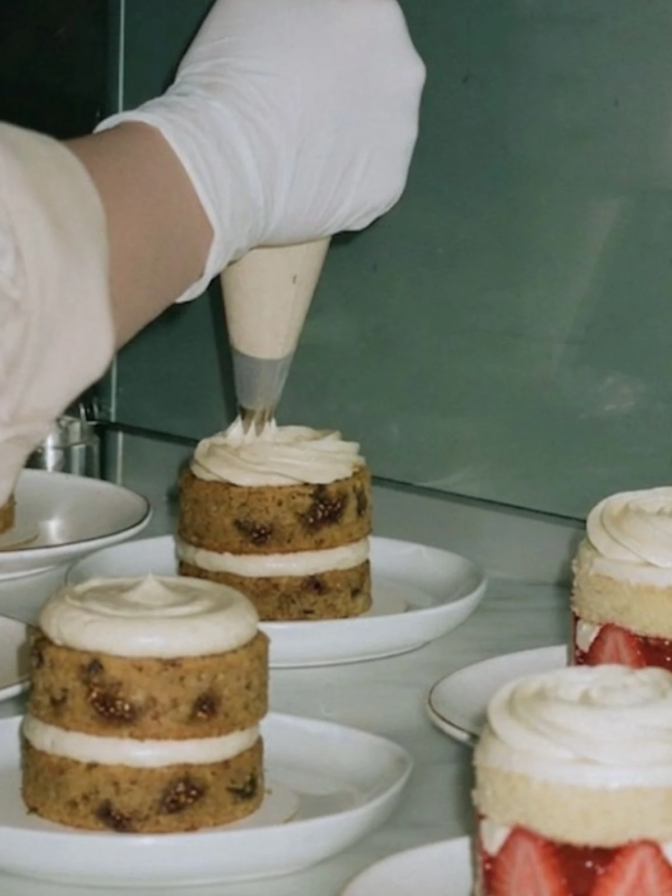
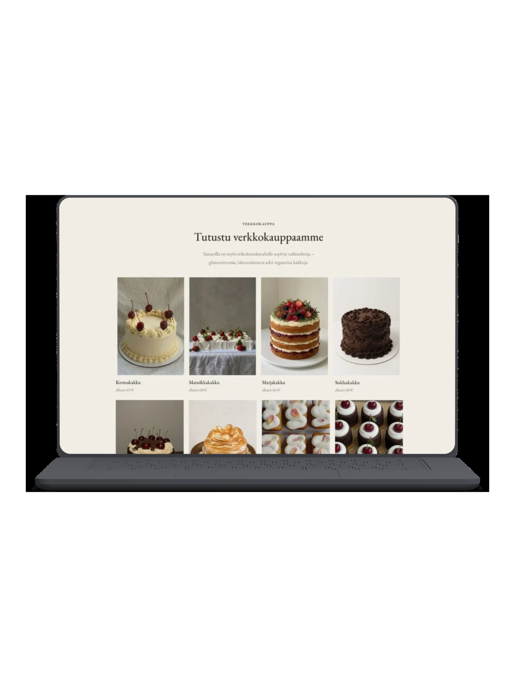
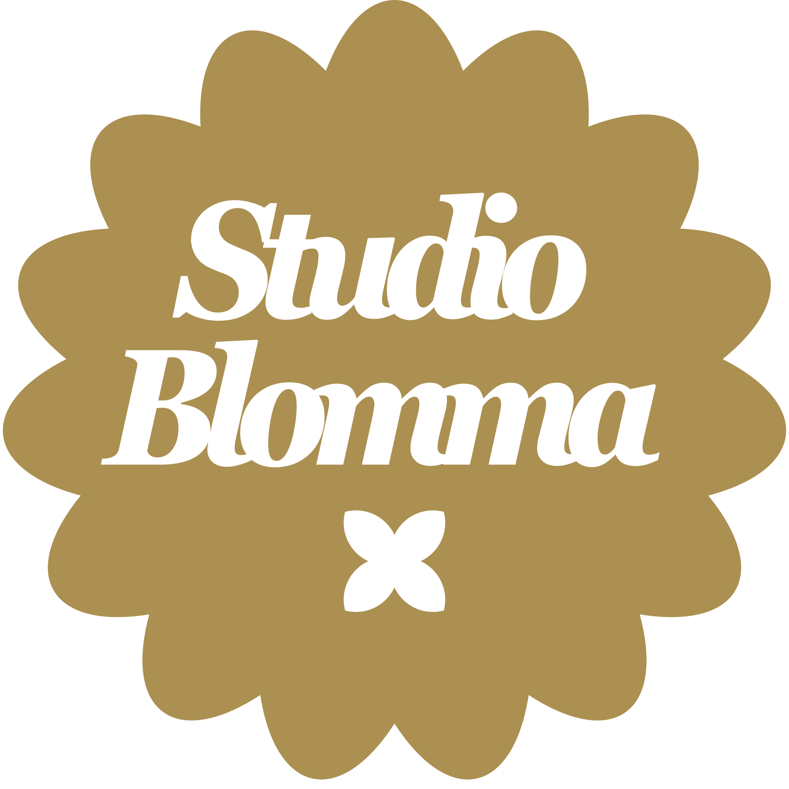

# Asettelu: "Harkitsetko verkkokaupan avaamista?" -osio (p804)

Tähän on tallennettu **tarkat arvot** siitä, miten tässä osiossa on sijoitettu
grafiikka (Studio Blomma -leima) ja kuinka suuri web-kuva (demo) on. Kopioimalla
nämä saat toisen grafiikan/kuvan **täsmälleen samaan asetteluun**.

Osio näkyy: `palvelut.html` (luokka `p804`). Tyylit: `style.css` (rivit ~1521–1533).

---

## 1) HTML-rakenne

Kolme kerrosta samassa laatikossa `.p804__media`:

```html
<div class="p804__media">
  <!-- A) Taustavalokuva (koko alueen täyttävä) -->
  

  <!-- B) ISO WEB-KUVA / demo (keskellä) -->
  <div class="p804__demo">
    
  </div>

  <!-- C) PIENI GRAFIIKKA / leima (vasemmalla ylhäällä, vinossa) -->
  
</div>
```

Kerrosjärjestys (z-index): tausta (0) → tummennus (1) → web-kuva (2) → grafiikka (3, päällimmäisenä).

---

## 2) Web-kuvan koko (`.p804__demo` + kuva)

```css
.p804__demo {
  position: absolute; inset: 0; z-index: 2;
  display: flex; align-items: center; justify-content: center;
  padding: 24px;                 /* tyhjä reuna kuvan ympärillä */
}
.p804__demo img {
  max-height: 98%;               /* KOKO: lähes koko korkeus */
  max-width: 100%;               /* KOKO: koko leveys */
  width: auto; height: auto;     /* säilyttää kuvasuhteen */
  border-radius: var(--radius-s);
}
```

**Web-kuvan koko lyhyesti:** keskitetty, `max-height: 98%`, `max-width: 100%`,
ympärillä `24px` pehmuste. Kuvasuhde säilyy (`width/height: auto`).

---

## 3) Grafiikan sijainti (`.p804__deco`)

```css
.p804__deco {
  position: absolute;
  top: calc(33.5% - 7.5px);      /* SIJAINTI: pystysuunnassa ~31 % ylhäältä */
  left: 19%;                     /* SIJAINTI: vaakasuunnassa 19 % vasemmalta */
  transform: translate(-50%, -50%) rotate(-20deg);  /* keskitys pisteeseen + kallistus -20° */
  width: 110px;                  /* KOKO: grafiikan leveys */
  height: auto;
  z-index: 3;
  pointer-events: none;          /* ei nappaa klikkauksia */
}
```

**Grafiikan sijainti lyhyesti:**
- Ankkuripiste: **ylhäältä ~31 %** (`top: calc(33.5% - 7.5px)`), **vasemmalta 19 %** (`left: 19%`).
- `transform: translate(-50%, -50%)` → grafiikan **keskipiste** osuu tuohon pisteeseen.
- Kallistus: **-20°** (`rotate(-20deg)`).
- Leveys: **110px** (korkeus skaalautuu automaattisesti).

---

## 4) Laatikko ja tausta (viitteeksi)

```css
.p804__media { position: relative; overflow: hidden; background: var(--vari-3); min-height: 320px; }
.p804__bg     { width: 100%; height: 100%; object-fit: cover; display: block; }
.p804__media::after { content: ""; position: absolute; inset: 0; background: rgba(0,0,0,.40); } /* tummennus 40 % */
@media (max-width: 900px) { .p804__media { min-height: 40vh; } }
```

---

## Näin toistat saman toisella grafiikalla

1. Tee uudelle osiolle sama HTML-rakenne (kolme kerrosta: `__bg`, `__demo`, `__deco`).
2. Kopioi yllä olevat CSS-arvot uusille luokille (tai käytä samoja).
3. Vaihda vain tiedostot: taustakuva (`__bg`), web-kuva (`__demo img`) ja grafiikka (`__deco`).
4. Grafiikan paikka/koko/kallistus ja web-kuvan koko pysyvät samoina, kun käytät
   samoja arvoja: **grafiikka** top `calc(33.5% - 7.5px)`, left `19%`,
   `translate(-50%,-50%) rotate(-20deg)`, width `110px`; **web-kuva** max-height `98%`,
   max-width `100%`, padding `24px`.
